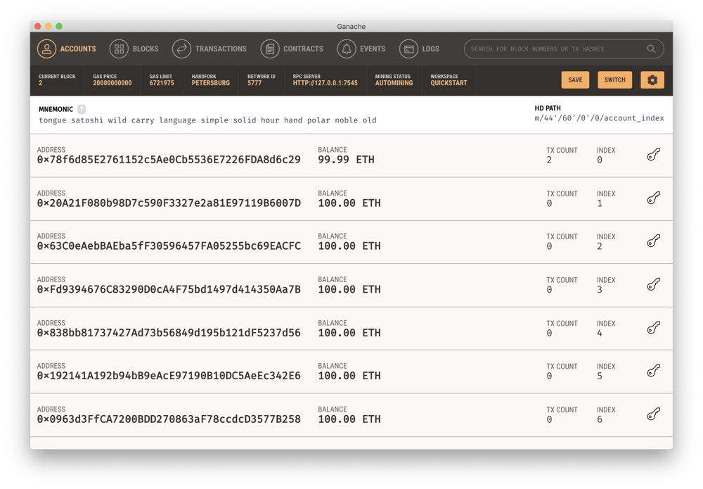

# my-first-ethereum-dapp

An introduction to developing decentralized applications (dapps) on Ethereum using a simple
step-by-step tutorial. This will take you through the process of building a dapp that allows
several users to interact with one another.

## Setting up our development environment

1. Download and install [Ganache](https://www.trufflesuite.com/ganache).
1. Enter the desired npm environment if using nvm.
    `nvm install lts/dubnium && nvm use lts/dubnium`
1. Install some prerequisite tools.
    `npm install -g truffle@5.0.32`
1. Initialize this project with some default npm settings.
    `npm init -y`
1. Install some dependencies.
    `npm install @openzeppelin/contracts chai`
1. Initialize this project for smart contract testing using truffle.
    `truffle init`

## Creating our smart contract

In order to demonstrate user interaction, this dapp will let users create polls that other
users can respond to. The polls will be managed through a smart contract. We'll begin by
generating a new smart contract.

`truffle create contract Polls`

This generated a simple contract file: `contracts/Polls.sol`:

```solidity
pragma solidity ^0.5.12;

contract Polls {
  constructor() public {
  }
}
```

In order for truffle to know how to compile and execute this contract properly, we must make
a few alterations to `truffle-config.js`. We want to first tell it how to connect to our test
network, which will be run by Ganache. Begin by running Ganache in quick start mode. You
should see something like this:



We'll also need to update our `truffle-config.js` to tell it how to connect to Ganache.
Uncomment the section specifying the development network's configuration and change the port
to be the one Ganache is running on (it defaults to 7545).

```javascript
development: {
  host: "127.0.0.1",
  port: 7545,
  network_id: "*"
},
```

We also need to tell Truffle to use the same solidity compiler version that our contract is
written for. Change the compiler settings at the bottom of `truffle-config.js` as follows:

```javascript
compilers: {
  solc: {
    version: "0.5.12"
  }
}
```

We'll be writing tests as we go to make sure that our contract functionality works as expected.
Truffle can help us by creating a scaffolding for our unit tests.

`truffle create test Polls`

We should now be able to run this test and verify that it fails.
```
∴ truffle test
Using network 'development'.

  Contract: Polls
    1) should assert true
    > No events were emitted

  0 passing (49ms)
  1 failing

  1) Contract: Polls
       should assert true:
     ReferenceError: Polls is not defined
      at Context.<anonymous> (/Users/cayblood/Source/tutorials/my-first-ethereum-dapp/test/polls.js:3:17)
      at web3.eth.getBlockNumber.then.result (/Users/cayblood/.nvm/versions/node/v10.16.3/lib/node_modules/truffle/build/webpack:/packages/truffle-core/lib/testing/testrunner.js:134:1)
      at process._tickCallback (internal/process/next_tick.js:68:7)
```
And we should be able to make it pass by requiring the right contract artifact at the top of our
test file.
```javascript
const Polls = artifacts.require('Polls');

contract('Polls', function(accounts) {
  it("should assert true", function(done) {
    var polls = Polls.deployed();
    assert.isTrue(true);
    done();
  });
});
```
Running the tests again should now result in success.
```
∴ truffle test
Using network 'development'.

  Contract: Polls
    ✓ should assert true

  1 passing (16ms)
```
Of course, this test doesn't do anything yet, so we'll need to replace it with something
meaningful. We'll begin by testing that users can create new polls.

```javascript
const Polls = artifacts.require('Polls');

contract('Polls', async (accounts) => {
  let instance;

  const assertPollModifiedEvent = (result, i) => {
    let logs = result.logs[0];
    assert.equal(logs.event, 'pollModified', 'Expected pollModified event');
    assert.equal(logs.args[0], creator);
    assert.equal(logs.args[1], i);
  };

  beforeEach(async () => {
    instance = await Polls.new();
  });

  describe('A user', () => {
    it('Can create a new poll', async () => {
      const title = web3.utils.fromAscii('My Cool Poll');
      const ownerName = web3.utils.fromAscii('Alice');
      const question = 'What is your favorite color?';
      assert.equal(await instance.pollCount(), 0);
      const result = await instance.createPoll(title, question, ownerName);
      assertPollModifiedEvent(result, 0, 0);
      assert.equal(await instance.pollCount(), 1);
    });
  });
});
```

This test relies on two contract methods, `pollCount` and `createPoll`. A getter
method for `pollCount` is provided to us automatically when we declare it as a
contract variable. We should verify that the test fails because the contract
methods haven't been declared yet, then implement the necessary contract features:

```solidity
pragma solidity ^0.5.12;

contract Polls {
    struct Poll {
        bytes32 title;
        string question;
        uint optionCount;
        uint voteCount;
        string[] options;
        uint[] optionVoteCounts;
        mapping(address => uint) votes;
        uint index;
        address owner;
    }

    event pollModified(address indexed _owner, uint _index);

    uint public pollCount = 0;
    Poll[] public polls;
    mapping(address => bytes32) ownerNames;

    function createPoll(bytes32 title, string memory question, bytes32 ownerName) public returns (uint index) {
        Poll memory p;
        p.title = title;
        p.question = question;
        p.index = pollCount;
        p.owner = msg.sender;
        polls.push(p);
        pollCount++;
        ownerNames[msg.sender] = ownerName;
        emit pollModified(p.owner, p.index);
        return p.index;
    }
}
```

Begin implementing additional contract features. Here is a list of the features
we need to test. Consult the implementation in the `example` folder for reference.

```
Contract: Polls
  A user
    ✓ Can create a new poll (98ms)
    ✓ Cannot modify another user's poll (108ms)
    ✓ Can retrieve all polls (168ms)
    ✓ Can view a recently created poll (63ms)
    ✓ Returns an error if a requested poll does not exist
    ✓ can add an option to a poll (167ms)
    ✓ can retrieve the count of options in a poll (178ms)
    ✓ can retrieve a specified option from a poll (188ms)
    ✓ returns an error if a requested option does not exist (55ms)
    ✓ can remove an option from a poll (207ms)
    ✓ can edit the text of an existing poll option (201ms)
    ✓ can edit the title of an existing poll (74ms)
    ✓ can edit the question of an existing poll (74ms)
    ✓ can vote for an option in a poll (211ms)
    ✓ can see if they've already voted for a poll (217ms)

15 passing (3s)
```

Of course, most users aren't going to want to interact with smart contracts
using just consoles and javascript. Web3 libraries enable developers to write
user-friendly interfaces for interacting with smart contracts. You can find an
example of a React-based web frontend in the `example/app` folder.
